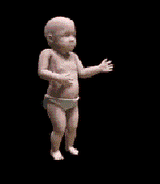

# IDEA 120: Digital Practices in Art and Design
### Schedule for Spring 2022

*Screenshot from [Jodi (Collective) 'wwwwwwwww'](http://wwwwwwwww.jodi.org/)*

#### Contents
* [Introduction and About the Schedule](#introduction-and-about-the-schedule)
* Week 1: [Week of January 10, 2022](#week-1)
* Week 2: [Week of January 17, 2022](#week-2)
* Week 3: [Week of January 24, 2022](#week-3)
* Week 4: [Week of January 31, 2022](#week-4)
* Week 5: [Week of February 7, 2022](#week-5)
* Week 6: [Week of February 14, 2022](#week-6)
* Week 7: [Week of February 21, 2022](#week-7)
* Week 8: [Week of February 28, 2022](#week-8)
* Week 9: [Week of March 7, 2022](#week-9)
* Week 10: [Week of March 14, 2022](#week-10)
* Week 11: [SPRING BREAK - no class](#week-11)
* Week 12: [Week of March 28, 2022](#week-12)
* Week 13: [Week of April 4, 2022](#week-13)
* Week 14: [Week of April 11, 2022](#week-14)
* Week 15: [Week of April 18, 2022](#week-15)
* Week 16: [Week of April 25, 2022](#week-16)

***

### Introduction and About the Schedule

This document is the current course schedule broken down by week.

In this document, under each week there are a list of assigned videos, texts, and exercises to complete for that Thursday (by midnight), along with how and where to submit assignments. The contents of this document will be updated throughout the semester.

***

## Unit 1: A Brief History of Digital Computing and the Arts

### Week 1
#### Week of January 11, 2022: Course Introduction

This first week you should review the [course syllabus](SYLLABUS.md) and access your first lecture, reading, and assignments. I (Tiffany) will hold open office hours on Thursday, January 14, via Zoom. Zoom invite details are on Blackboard.

DUE **Thursday, January 14**:
* Review [course syllabus](SYLLABUS.md)
* DOWNLOAD and review [Week 1 guide](https://docs.google.com/presentation/d/1CWfBMEoSHCvFx0WdQB7-BuJkrtODb3ga_s1rdj0_5q4/edit?usp=sharing)
* Read [Rachel Green, Web Work - A History of Net Art](/week_01_week_of_01-11-2021/readings/Rachel-Green-Web-Work-A-History-of-Net-Art-WEEK-01.pdf)

Tuesday Recording:
https://uic.zoom.us/rec/share/T9IhmfjwtPb0DfdZqBCDZx4axUfIebDDmXwIO9PW8ltW-tReCYaiiE5iBuBYQjF_.owTlsrmhGxeixSbr

Thursday Recording:
https://uic.zoom.us/rec/share/43HqqCj9VBPQ_jzAcv0dSs3FAf83PcvNmLgttacm2-oIXgYQgFs6RWK5oNzsG44a.I8RVkUr7PtW0cYgD

***

### Week 2
#### Week of January 18, 2022: Computing in Design and Arts Practices

DUE **Thursday, January 21**:
* DOWNLOAD and review [Week 2 guide](https://docs.google.com/presentation/d/1eJpnWnj7eaZ4ezTom1rtXaewIAAxGGN9wRQdRqQTwRE/edit?usp=sharing)
* [Watch Lecture: Early Computing and the Arts](https://vimeo.com/452741250/0b4773d055)
* Read [Janet Murray, Hamlet on the Holodeck: Chapter 3](/week_02_week_of_01-18-2021/readings/Janet-Murray-Hamlet-on-the-Holodeck-Chapter-3-WEEK-02.pdf)
* Watch [Daniel Shiffman, Git and GitHub for Poets](https://www.youtube.com/watch?v=BCQHnlnPusY)
* Create [a new GitHub Account](https://github.com/join)
* Email your GitHub username to: [tfunk4@uic.edu](mailto:tfunk4@uic.edu)
* Create [a new public repository (Step 1 only)](https://guides.github.com/activities/hello-world/#repository) and name it 'idea-120-responses-YOUR_GITHUB_USERNAME'
* Create a new [markdown](https://guides.github.com/features/mastering-markdown/#what) file [called 'week-02-murray-poem.md'](https://docs.github.com/en/github/managing-files-in-a-repository/creating-new-files) and write a five-line poem about the Murray reading. Using [GitHub markdown syntax](https://guides.github.com/features/mastering-markdown/#what) link to any YouTube video that you feel is related to your poem and include at least 2 images
* 'Commit' the new file to your repository with a description

Tuesday Recording:
https://uic.zoom.us/rec/share/iREObjzaRJPieW6boJ044DokUVTe4i6jlg9de7lti8XmFl5pWgOhTKK0MaUJDT9t.O20bLNYvHidNz75o

Thursday Recording:
https://uic.zoom.us/rec/share/H9RcS82JN28Pr0O1zjBJBaComG5eRgKfNRA1thtm5orT8CHWOYW34JKlNtxyiuqT.d_X0kEwvO7KVQ3l1

***

### Week 3
#### Week of January 25, 2022: A Brief History of (Digital, and other) Media in Art

DUE **Thursday, January 28**:
* DOWNLOAD and review [Week 3 guide](/week_03_week_of_01-25-2021/wk03_digitalhistory.pdf)
* [Watch Lecture: A Brief History of the Internet](https://vimeo.com/453838373/165226d296)
* Review [Week 3 guide](/week_03_week_of_01-25-2021/wk03_digital_history.pdf)
* Explore [Chapter 1: 1984-1998 of the Rhizome Anthology of Net Art](https://anthology.rhizome.org/) and read and look at the examples of early art on the world wide web.
* Read [Chris Salter, Entangled](/week_03_week_of_01-25-2021/readings/Chris-Salter-Entangled-WEEK-03.pdf)
* Respond to the reading by creating a new markdown file named 'week-03-salter.md' in your 'idea-120-responses' repository and write 2-3 paragraphs that explore what contemporary tools (digital or physical) could be used to create art that could be considered a *Gesamtkunstwerk*. Is there an example in the Rhizome Anthology that could qualify?
 * Be sure to format your writing (including a header for your title) using [markdown syntax](https://guides.github.com/features/mastering-markdown/) and add a hidden message (or [ASCII-text-image](https://www.asciiart.eu/art-and-design/mona-lisa)) using [HTML comments](https://www.w3schools.com/html/html_comments.asp)
* Download and install [the Atom text editor](https://atom.io/)
* [Watch Tutorial: Installing Atom and adding a GitHub Repository](https://vimeo.com/454929880/e8fca32290) and complete the steps yourself with your 'idea-120-responses' repository
* Read the description for [Project 1: GitHub Poetry (due week 5)](/week_03_week_of_01-25-2021/project-1-github-poetry.md) and follow the instructions there to create a GitHub pages site

Tuesday Recording:
https://uic.zoom.us/rec/share/XRm0-eePJipLaGMQTnpppfs6io9R3V96Ir6oeeI-objPbU3Vq2hCayM57LBbRkTH.Ogh972ZyR7RUiN8z

Thursday Recording:
https://uic.zoom.us/rec/share/LPKflAFsg2lEIMh5v13hcO-xF0DPYBERBvz9ux5APdHeYvosN79x3ocj9sSgDRhy.ahLcILMoBWdFGtU2

***

### Week 4
#### Week of January 31, 2022: Media Theory, Part 1

DUE **Thursday, February 3**:
* DOWNLOAD and review [Week 4 guide](/week_04_week_of_02-01-2021/wk04_mediatheory1.pdf)
* [Watch Lecture: Hot Media, Cool Semiotics, Part 1](https://vimeo.com/456042103/5ec7e1ceeb)
* Read [Marshall McLuhan, Understanding Media: Media Hot and Cold](/week_04_week_of_02-01-2021/readings/Marshall-McLuhan-Understanding-Media-Media-Hot-and-Cold-WEEK-04.pdf)
* Read [Roland Barthes, Image-Music-Text: 'The Rhetoric of the Image'](/week_04_week_of_02-01-2021/readings/Roland-Barthes-Image-Music-Text-The-Rhetoric-of-the-Image-WEEK-04.pdf)
* In Atom, create a new markdown file named 'week-04-response.md' and save it in your 'idea-120-responses' repository
* In this response provide an example of a kind of image that would be read differently if it were seen in another medium (for example, posts by Instagram 'influencers', food photography, or [click-bait news articles](https://en.wikipedia.org/wiki/Clickbait)). What are the 'three messages' (as laid out by Barthes) this kind of image contains?  
* Save the file and ['stage all' changes in the Git tab](https://flight-manual.atom.io/using-atom/sections/github-package/#stage), add a 'Commit message', click 'Commit to master' and ['Push' the new document to your repository](https://flight-manual.atom.io/using-atom/sections/github-package/#publish-and-push)
* Read W3C's [HTML Tutorial from 'HTML Introduction' to 'HTML Emojis'](https://www.w3schools.com/html/default.asp)
* Read W3C's [CSS Tutorial from 'CSS Introduction' to 'CSS Position'](https://www.w3schools.com/css/default.asp)

Tuesday Recording:
https://uic.zoom.us/rec/share/daY7zeS1m0X7CDQJKJEiHoeOVvHVgst7KQkW0ZShVdmMTYpRO89FiIGh5_5SWezq.ETX8NluCnV4atlSG

Thursday Recording:
https://uic.zoom.us/rec/share/-ggULwkG7R8QS_a0G77oI8KTACBM2BvG-NZO7CF5d4OF7MpVQpmVBONBahYTQdWZ.oBZ6430Cmktd1sSZ

***

### Week 5
#### Week of February 7, 2022: Media Theory, Part 2

DUE **Thursday, February 10**:
* DOWNLOAD and review [Week 5 guide](/week_05_week_of_02-08-2021/wk05_mediatheory2.pdf)
* Watch [The Medium is the Message Minisode](https://www.youtube.com/watch?v=OseOb_wBsi4&ab_channel=FoldingIdeas)
* Read [Cathy O'Neil, Weapons of Math Destruction: 'Introduction', 'Chapter 1', 'Chapter 3', and 'Chapter 5'](/week_05_week_of_02-08-2021/readings/Cathy-O-Neil-Weapons-of-Math-Destruction-Intro-Ch-1-3-5-WEEK-05.pdf)
* Read [Marshall Mcluhan, Understanding Media: The Medium is the Message](/week_05_week_of_02-08-2021/readings/Marshall-McLuhan-Understanding-The-Medium-is-the-Message-WEEK-05.pdf)
* Read [Higgins and Kahn, Mainframe Experimentalism: First Generation Poetry Generators](/week_05_week_of_02-08-2021/readings/Hannah-Higgins-Douglas-Kahn-Mainframe-Experimentalism-First-Generation-Poetry-Generators-WEEK-05.pdf)
* In Atom, create a new markdown file named 'week-05-o-neil.md' and save it in your 'idea-120-responses' repository project folder. In this file give an example in about 3 paragraphs of a 'WMD' as O'Neil describes it.
* Push this file to your repository

DUE **Monday, February 14**:
* Final GitHub Poetry Project DUE
* Schedule a [one-on-one meeting with me for next week (02/15, 02/17, 02/18, or 02/19) on Calendly](https://calendly.com/tfunk4/office-hours-meeting)

Tuesday Recording:
https://uic.zoom.us/rec/share/-eieDzKuAC2c97MhhFeWeu8YFQo-QSXrc87PfPKBU-X2cVjS734o9p2G3tot_Oyu.Mwk4hAEkkS8JriGu

***

## Unit 2: Digital Literacy and Online Content Creation

### Week 6
#### Week of February 14, 2022: Digital Un-realities

One-on-one meetings this week before midterm grades are submitted

DUE **Thursday, February 17**:
* DOWNLOAD and review [Week 6 guide](https://docs.google.com/presentation/d/1HCValVmwd-A-Os9qooaZWzw6UR-sHtBnj5UlPVY42z8/edit?usp=sharing)
* Read [Janet Murray, Hamlet on the Holodeck: Chapter 9](/week_06_week_of_02-15-2021/readings/Janet-Murray-Hamlet-On-the-Holodeck-Chapter-9-WEEK-06.pdf)
* Read W3C's [HTML Media Tutorial from 'HTML Media' to 'HTML YouTube', ](https://www.w3schools.com/html/default.asp)
* Watch [Why 'The Mandalorian' Uses Virtual Sets Over Green Screen'](https://www.youtube.com/watch?v=Ufp8weYYDE8)
* In Atom, create a new markdown file named 'week-06-murray.md' and save it in your 'idea-120-responses' repository project folder. In this file discuss if you believe Murray's predictions about internet television and inhabiting virtual environments were successful. How does Murray's prediction compare to the hyper-realistic virtual environments the actors of 'The Mandalorian' inhabit while acting? Name and discuss the different layers of 'reality' both the actors and the viewers experience in the production.
* Push this file to your repository

Optional In-Class Lab **Tuesday, February 15, 9:30-10:45AM**
* Zoom link details in blackboard
* Creating a website in Atom (HTML and CSS fundamentals)
* Setting up a website in GitHub Pages
* Tutorial will be recorded and shared with the class

***

### Week 7
#### Week of February 21, 2022: A Series of Tubes: What's wrong with the internet?

DUE **Thursday, February 24**
* Review [Project 2: Green Screen](/week_07_week_of_02-22-2021/project-2_green-screen.md) expectations.
* Create a new markdown file in your repository called 'project-02-proposal.md'. Write a brief proposal (a few sentences) on what you plan to do for [Project 2: Green Screen](/week_07_week_of_02-22-2021/project-2_green-screen.md) and push it to your repository
* Read [James Bridle, Something is Wrong On the Internet](https://medium.com/@jamesbridle/something-is-wrong-on-the-internet-c39c471271d2)
* **Optional** *Read [‘You Can Still Make Websites Nowadays’: A Talk with the Pioneering Internet Art Collective JODI](https://www.artnews.com/art-news/artists/can-still-make-websites-nowadays-talk-pioneering-internet-art-collective-jodi-10653/)*
* **Optional** *Read [Perrigo, The World Wide Web Turns 30 Today. Here's How Its Inventor Thinks We Can Fix It](https://time.com/5549635/tim-berners-lee-interview-web/)*
* Complete [Tutorial: Setting up the virtual lab](/week_07_week_of_02-22-2021/Tutorial-Setting-Up-the-Virtual-Lab-WEEK-07.pdf)
* Read W3C's [CSS Tutorial from 'CSS Overflow' to 'CSS Specificity'](https://www.w3schools.com/css/default.asp)
* Create a new markdown document in your 'idea-120-responses' folder called 'week-07-response.md' and discuss in about 2 paragraphs if you agree with the problems and solutions laid out by Bridle. Bridle has a specific vision for what the internet 'should be'. Do you agree with this vision?
* Push the file to your repository

Optional In-Class Lab **Tuesday, February 22, 9:30-10:45AM**
* Zoom link details in blackboard
* Adobe Premiere Fundamentals
* Tutorial will be recorded and shared with the class via Github

DUE **Monday, February 28**:
* Submit improved GitHub Poetry Project by emailing me a link to your GitHub pages web address

***

### Week 8
#### Week of February 28, 2022: What is a model? Design and Algorithms

DUE **Thursday, March 3**:
* Watch [Mona Chalabi, 3 Ways to Spot a Bad Statistic](https://www.ted.com/talks/mona_chalabi_3_ways_to_spot_a_bad_statistic)
* Read [Cathy O'Neil, Weapons of Math Destruction: Chapter 4](/week_08_week_of_03-01-2021/readings/Cathy-O-Neil-Weapons-Of-Math-Destruction-Chapter-4-WEEK-08.pdf)
* Create a new markdown document in your 'idea-120-responses' folder called 'week-08-response.md' and discuss in about 2 paragraphs what methods outlined by O'Neil and Chalabi you believe you're subject to when using tools and consuming media on the internet. Would the internet be more useful and egalitarian without these methods (targeted ads, shaping interactions to content with specific design), or is it useful to direct users because your message could otherwise be lost among the sea of online content?
* Push the file to your repository

Optional In-Class Lab **Tuesday, March 1, 9:30-10:45AM**
* Zoom link details in blackboard
* Adobe Photoshop and Illustrator Fundamentals
* Tutorial will be recorded and shared with the class via Github

***

## Unit 3: Non-linear Narratives in Digital Media

### Week 9
#### Week of March 7, 2022: Personal Digital Narrative

DUE **Thursday, March 10**:
* Read [Lisa Nakamura, Digitizing Race: Introduction](/week_09_week_of_03-08-2021/readings/Lisa-Nakamura-Digitizing-Race-Intro-WEEK-09.pdf)
* Create a new markdown document in your 'idea-120-responses' folder called 'week-09-nakamura.md' and discuss in about 2 paragraphs how you believe Nakamura's citation of Lev Manovich saying "interactive media ask us to identify with someone else’s mental structure" is to be understood. Discuss one example in depth of how aspects of tools you may use (such as Gmail, Instagram, TikTok, etc) are reflections of the designer's or developer's 'mental structure' and their own identity.
* Push the file to your repository

DUE **Thursday, March 10**:
* Green Screen Project DUE

***

### Week 10
#### Week of March 14, 2022: Non-linear Narratives in Digital Media

DUE **Thursday, March 17**:
* [Read the description for Project 3: Non-linear Narrative](/week_10_week_of_03-15-2021/project-3_non-linear-narrative.md)
* Read [Merritt Kopas, Videogames for Humans, 'Introduction'](/week_10_week_of_03-15-2021/readings/Merritt-Kopas-Videogames-for-Humans-Intro-WEEK-10.pdf)
* Play [some of the twine games listed here](/week_10_week_of_03-15-2021/twineGames.md)
* Create a new markdown document in your 'idea-120-responses' folder called 'project-03-proposal.md' and write a 1-2 paragraph proposal explaining the concept for your non-linear narrative
* Push the file to your repository

Optional In-Class Lab **Tuesday, March 15, 9:30-10:45AM**
* Zoom link details in blackboard
* Introduction to Twine Workshop - [a tool for making non-linear games](https://twinery.org/)
* Tutorial will be recorded and shared with the class

***

### Week 11
#### Week of March 21, 2022: SPRING BREAK!

### Week 12
#### Week of March 28, 2022: Game Design for Artists, Part 1

DUE **Thursday, March 31**:
* Read [Anna Anthropy, Rise of Videogame Zinesters: Chapter 1 and 2](/week_12_week_of_03-29-2021/readings/Anna-Anthropy-Rise-of-the-Videogame-Zinesters-Ch-1-2-WEEK-12.pdf)
* Create a new markdown document in your 'idea-120-responses' folder called 'week-12-anthropy.md' and discuss in about 4 paragraphs how accessibility in gaming and coding can help improve video games. Think about what we can gain from a larger number of voices participating in creating games and what other kinds of media (e.g. theater, physical games) could also benefit from using 'game' creation tools
* Push the file to your repository

***

### Week 13
#### Week of April 4, 2022: Game Design for Artists, Part 2

*Possible playthrough of [Olia Lialina, My Boyfriend Came Back from the War](http://www.teleportacia.org/war/wara.htm)*

DUE **Thursday, April 7**:
* Read [Anna Anthropy, Rise of Videogame Zinesters: Chapter 3 and 4](/week_13_week_of_04-05-2021/readings/Anna-Anthropy-Rise-of-the-Videogame-Zinesters-Ch-3-4-WEEK-12.pdf)
* Create a new markdown document in your 'idea-120-responses' folder called 'week-13-anthopy.md' and respond with around 3 questions these readings brought up for you. Pick one and discuss it in 3 paragraphs
* Push the file to your repository
* Read the description for [Project 4: Personal Portfolio](week_13_week_of_04-05-2021/project-4_personal-portfolio.md)
* Create a new markdown document in your 'idea-120-responses' folder called 'project-04-proposal.md' and explain in about 1 paragraph what content you'll include in your portfolio and how it will be organized.
* Draw (or layout in Illustrator) the basic layout that you will use for your Portfolio and [add this drawing to your repository](https://docs.github.com/en/github/managing-files-in-a-repository/adding-a-file-to-a-repository) as a photo or exported from Illustrator
* Push your proposal to your repository

DUE **Thursday, April 7**
* Schedule a [one-on-one meeting with me for next week (04/12, 04/14, or 04/15) on Calendly](https://calendly.com/tfunk4/office-hours-meeting)

***

### Week 14
#### Week of April 11, 2021

One-on-one meetings this week before Non-linear Narrative DUE

DUE **Thursday, April 14**:
* Non-linear Narrative Project DUE

***

### Week 15
#### Week of April 18, 2021

Continue working on your Final Portfolio Project

***

### Week 16
#### Week of April 25, 2021

DUE **Thursday, April 28**:
* Final Portfolio Project

***

*The classic [Dancing Baby](https://knowyourmeme.com/memes/dancing-baby)*
