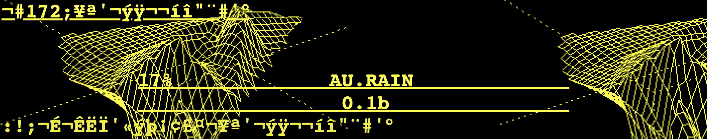

# IDEA 120: Digital Practices in Art and Design
### Schedule for Fall 2020

*Screenshot from [Jodi (Collective) 'wwwwwwwww'](http://wwwwwwwww.jodi.org/)*

#### Contents
* [Introduction and About the Schedule](#introduction-and-about-the-schedule)
* Week 1: [Week of August 24, 2020](#week-1)
* Week 2: [Week of August 31, 2020](#week-2)
* Week 3: [Week of September 7, 2020](#week-3)
* Week 4: [Week of September 14, 2020](#week-4)
* Week 5: [Week of September 21, 2020](#week-5)
* Week 6: [Week of September 28, 2020](#week-6)
* Week 7: [Week of October 5, 2020](#week-7)
* Week 8: [Week of October 12, 2020](#week-8)
* Week 9: [Week of October 19, 2020](#week-9)
* Week 10: [Week of October 26, 2020](#week-10)
* Week 11: [Week of November 2, 2020](#week-11)
* Week 12: [Week of November 9, 2020](#week-12)
* Week 13: [Week of November 16, 2020](#week-13)
* Week 14: [Week of November 23, 2020](#week-14)
* Week 15: [Week of November 30, 2020](#week-15)

***

### Introduction and About the Schedule

This document is the current course schedule broken down by week.

In this document, under each week there are a list of assigned videos, texts, and exercises to complete by the following Tuesday or the discussion the following Thursday, along with how and where to submit assignments.  The contents of this document will be updated throughout the semester.

***

## Unit 1: A Brief History of Digital Computing and the Arts

### Week 1
#### Week of August 24, 2020: Course Introduction

This first week we will be meeting on Tuesday to Review the Syllabus and you will get your first lecture, reading, and assignments.

DUE **Thursday, August 27**:
* Review [course syllabus](SYLLABUS.md)
* Read [Rachel Green, Web Work - A History of Net Art](/week_01_week_of_08-24-2020/readings/Rachel-Green-Web-Work-A-History-of-Net-Art-WEEK-01.pdf)

***

### Week 2
#### Week of August 31, 2020: Computing in Design and Arts Practices

DUE **Tuesday, September 1**:
* Read [Janet Murray, Hamlet on the Holodeck: Chapter 3](/week_02_week_of_08-31-2020/readings/Janet-Murray-Hamlet-on-the-Holodeck-Chapter-3-WEEK-02.pdf)
* Watch [Daniel Shiffman, Git and GitHub for Poets](https://www.youtube.com/watch?v=BCQHnlnPusY)
* Create [a new GitHub Account](https://github.com/join)
* Email your GitHub username to: [jkelle28@uic.edu](mailto:jkelle28@uic.edu)
* Create [a new public repository (Step 1 only)](https://guides.github.com/activities/hello-world/#repository) and name it 'idea-120-responses-YOUR_GITHUB_USERNAME'
* Create a new [markdown](https://guides.github.com/features/mastering-markdown/#what) file [called 'week-01-murray-poem.md'](https://docs.github.com/en/github/managing-files-in-a-repository/creating-new-files) and write a five-line poem about the Murray reading. Using [GitHub markdown syntax](https://guides.github.com/features/mastering-markdown/#what) link to any YouTube video that you feel is related to your poem and include at least 2 images
* 'Commit' the new file to your repository with a description

***

### Week 3
#### Week of September 7, 2020: A Brief History of (Digital, and other) Media in Art

DUE **Tuesday, September 8**:
* ***VIDEO AVAILABLE on 8/30*** ~~Watch Lecture: A Brief History of the Internet and Net Art~~
* Read W3C's [HTML Tutorial from 'HTML Introduction' to 'HTML Emojis', ](https://www.w3schools.com/html/default.asp)
* Read [Chris Salter, Entangled](/week_03_week_of_09-07-2020/readings/Chris-Salter-Entangled-WEEK-03.pdf)
* Respond to the reading by creating a new markdown file named 'week-02-salter.md' in your 'idea-120-responses' repository and write 3-4 paragraphs that explore what contemporary tools (digital or physical) could be used to create art that would be *Gesamtkunstwerk*.
 * Be sure to format your writing (including a header for your title) using [markdown syntax](https://guides.github.com/features/mastering-markdown/) and add a hidden message (or [ASCII-text-image](https://www.asciiart.eu/art-and-design/mona-lisa)) using [HTML comments](https://www.w3schools.com/html/html_comments.asp)
* Download and install [the Atom text editor](https://atom.io/)
* ***VIDEO AVAILABLE on 8/30*** ~~Watch Tutorial: Installing Atom and adding a GitHub Repository~~ and complete the steps yourself with your 'idea-120-responses' repository
* Read the description for [Project 1: GitHub Poetry (due week 5)](/github-poetry) and follow the instructions there to create a GitHub pages site

***

### Week 4
#### Week of September 14, 2020: Media Theory, Part 1

DUE **Tuesday, September 15**:
* ***VIDEO AVAILABLE on 9/07*** ~~Watch Lecture: Hot Media, Cool Semiotics, Part 1~~
* Read [Marshall McLuhan, Understanding Media: Media Hot and Cold](/week_04_week_of_09-14-2020/readings/Marshall-McLuhan-Understanding-Media-Media-Hot-and-Cold-WEEK-04.pdf)
* Read [Roland Barthes, Image-Music-Text: 'The Rhetoric of the Image'](/week_04_week_of_09-14-2020/readings/Roland-Barthes-Image-Music-Text-The-Rhetoric-of-the-Image-WEEK-04.pdf)
* In Atom, create a new markdown file named 'week-03-response.md' and save it in your 'idea-120-responses' repository
* In this response provide an example of a kind of image that would be read differently if it were seen in another medium (for example, posts by Instagram 'influencers', food photography, or [click-bait news articles](https://en.wikipedia.org/wiki/Clickbait)). What are the 'three messages' (as laid out by Barthes) this kind of image contains?  
* Save the file and ['stage all' changes in the Git tab](https://flight-manual.atom.io/using-atom/sections/github-package/#stage), add a 'Commit message', click 'Commit to master' and ['Push' the new document to your repository](https://flight-manual.atom.io/using-atom/sections/github-package/#publish-and-push)
* Read W3C's [CSS Tutorial from 'CSS Introduction' to 'CSS Position'](https://www.w3schools.com/css/default.asp)

DUE **Thursday, September 17, 2020 before discussion**

Collaborating with 'Pull Requests' Partner Feedback (we'll discuss the questions you write to your partner):
* On the GitHub website create [a new branch](https://guides.github.com/activities/hello-world/#branch) in your 'idea-120-responses' repository and name it 'week-03-feedback-YOUR_GITHUB_USERNAME'
* ***PARTNER DOC AVAILABLE on 9/07*** ~~Invite your partner to your new branch~~ 'week-03-feedback' repository as a collaborator [using these instructions](https://docs.github.com/en/github/setting-up-and-managing-your-github-user-account/inviting-collaborators-to-a-personal-repository)
* Accept your partner's invitation to collaborate on their repository and [open their 'week-03-mcluhan.md' file](https://guides.github.com/activities/hello-world/#commit) in their 'week-03-feedback' repository and add a short reaction (around a paragraph) asking any new questions their response sparked for you
* Write a short, genuine, reaction and ask a few questions to your partner about their response. Save the file and [commit the changes](https://guides.github.com/activities/hello-world/#commit)
* Open a [pull request](https://guides.github.com/activities/hello-world/#pr) for your committed changes and write a short description explaining what changes you made to the document
* Now go to your own 'week-03-feedback' repository and [merge the pull request your partner created when they edited your document](https://guides.github.com/activities/hello-world/#pr). This will merge your partners edits with the original 'week-03-mcluhan.md' file in your master 'idea-120-responses' repository.
* Delete the 'week-03-feedback' branch by clicking the 'Delete Branch' button when it appears

***

### Week 5
#### Week of September 21, 2020: Media Theory, Part 2

DUE **Tuesday, September 22**:
* ***VIDEO AVAILABLE on 9/14*** ~~Watch Lecture: Hot Media, Cool Semiotics, Part 2~~
* Read [Cathy O'Neil, Weapons of Math Destruction: 'Introduction', 'Chapter 1', 'Chapter 3', and 'Chapter 5'](/week_05_week_of_09-21-2020/readings/Cathy-O-Neil-Weapons-of-Math-Destruction-Intro-Ch-1-3-5-WEEK-05.pdf)
* Read [Marshall Mcluhan, Understanding Media: The Medium is the Message](/week_05_week_of_09-21-2020/readings/Marshall-McLuhan-Understanding-The-Medium-is-the-Message-WEEK-05.pdf)
* Read [Higgins and Kahn, Mainframe Experimentalism: First Generation Poetry Generators](/week_05_week_of_09-21-2020/readings/Hannah-Higgins-Douglas-Kahn-Mainframe-Experimentalism-First-Generation-Poetry-Generators-WEEK-05.pdf)
* In Atom, create a new markdown file named 'week-04-o-neil.md' and save it in your 'idea-120-responses' repository project folder. In this file give an example in about 3 paragraphs of a 'WMD' as O'Neil describes it.
* Push this file to your repository

DUE **Thursday, September 24**:
* GitHub Poetry Project critique
* Schedule a [one-on-one meeting with me for next week (9/28, 9/29, 9/30, or 10/1) on Calendly](https://calendly.com/jaredchrstphrkelley/15min1on1)

***

## Unit 2: Digital Literacy and Online Content Creation

### Week 6
#### Week of September 28, 2020: Digital Un-realities

One-on-one meetings this week before midterm grades are submitted

DUE **Tuesday, September 29**:
* ***VIDEO AVAILABLE on 9/21*** ~~Watch Lecture: Totally Regular Reorientation~~
* Read [Janet Murray, Hamlet on the Holodeck: Chapter 9](/week_06_week_of_09-28-2020/readings/Janet-Murray-Hamlet-On-the-Holodeck-Chapter-9-WEEK-06.pdf)
* Read W3C's [HTML Media Tutorial from 'HTML Media' to 'HTML YouTube', ](https://www.w3schools.com/html/default.asp)
* Watch [Why 'The Mandalorian' Uses Virtual Sets Over Green Screen'](https://www.youtube.com/watch?v=Ufp8weYYDE8)
* In Atom, create a new markdown file named 'week-05-murray.md' and save it in your 'idea-120-responses' repository project folder. In this file discuss if you believe Murray's predictions about internet television and inhabiting virtual environments were successful. How does Murray's prediction compare to the hyper-realistic virtual environments the actors of 'The Mandalorian' inhabit while acting? Name and discuss the different layers of 'reality' both the actors and the viewers experience in the production.
* Read the description for [Project 2: Green Screen](/green-screen) and in Atom create a new markdown file called 'project-02-proposal.md' and save it to your 'idea-120-responses' repository. Write a one paragraph proposal for Project 2 that explains how you will create the feeling of immersion in green-screen background
* Push both files to your repository

***

### Week 7
#### Week of October 5, 2020: A Series of Tubes: What is the Internet?

**Graduate Student Mid-terms - No discussion or one-on-one sessions this week**

DUE **Tuesday, October 6**:
* ***VIDEO AVAILABLE on 9/28*** ~~Watch Lecture: What is the Internet?~~
* Read [‘You Can Still Make Websites Nowadays’: A Talk with the Pioneering Internet Art Collective JODI](https://www.artnews.com/art-news/artists/can-still-make-websites-nowadays-talk-pioneering-internet-art-collective-jodi-10653/)
* Read [James Bridle, Something is Wrong On the Internet](https://medium.com/@jamesbridle/something-is-wrong-on-the-internet-c39c471271d2)
* Read [Perrigo, The World Wide Web Turns 30 Today. Here's How Its Inventor Thinks We Can Fix It](https://time.com/5549635/tim-berners-lee-interview-web/)
* Read [Tutorial: Setting up the virtual lab](/week_06_week_of_09-28-2020/readings/virtual_computer_lab_setup.pdf) and complete the steps yourself
* ***VIDEO AVAILABLE on 9/28*** ~~Watch Tutorial: Illustrator Overview~~
* ***VIDEO AVAILABLE on 9/28*** ~~Watch Tutorial: Photoshop Overview~~
* Read W3C's [CSS Tutorial from 'CSS Overflow' to 'CSS Specificity'](https://www.w3schools.com/css/default.asp)
* Create a new markdown document in your 'idea-120-responses' folder called 'week-06-response.md' and discuss in about 3 paragraphs if you agree with the problems and solutions laid out by Bridle and Berners-Lee. Bridle and Berners-Lee have a specific vision for what the internet 'should be'. Do you agree with this vision?
* Push the file to your repository

***

### Week 8
#### Week of October 12, 2020: What is a model? Design and Algorithms

DUE **Tuesday, October 13**:
* ***VIDEO AVAILABLE on 10/05*** ~~Watch Lecture: Alternative Data Design~~
* Watch [Mona Chalabi, 3 Ways to Spot a Bad Statistic](https://www.ted.com/talks/mona_chalabi_3_ways_to_spot_a_bad_statistic)
* Read [Cathy O'Neil, Weapons of Math Destruction: Chapter 4](/week_08_week_of_10-12-2020/readings/Cathy-O-Neil-Weapons-Of-Math-Destruction-Chapter-4-WEEK-08.pdf)
* Read [Chris Gayomali, How typeface influences the way we read and think](https://theweek.com/articles/463196/how-typeface-influences-way-read-think)
* Create a new markdown document in your 'idea-120-responses' folder called 'week-07-response.md' and discuss in about 4 paragraphs what methods outlined by O'Neil, Chalabi, and Gayomali you believe you're subject to when using tools and consuming media on the internet. Would the internet be more useful and egalitarian without these methods (targeted ads, shaping interactions to content with specific design), or is it useful to direct users because your message could otherwise be lost among the sea of online content?
* Push the file to your repository

***

## Unit 3: Non-linear Narratives in Digital Media

### Week 9
#### Week of October 19, 2020: Personal Digital Narrative

DUE **Tuesday, October 20**:
* ***VIDEO AVAILABLE on 10/12*** ~~Watch Lecture: Agency, Identity, and Voice in Videogames~~
* Read [Lisa Nakamura, Digitizing Race: Introduction](/week_09_week_of_10-19-2020/readings/Lisa-Nakamura-Digitizing-Race-Intro-WEEK-09.pdf)
* Read the description for [Project 3: CSS/Typography](/css-typography)
* Create a new markdown document in your 'idea-120-responses' folder called 'week-08-nakamura.md' and discuss in about 4 paragraphs how you believe Nakamura's citation of Lev Manovich saying "interactive media ask us to identify with someone else’s mental structure" is to be understood. Discuss one example in depth of how aspects of tools you may use (such as Gmail, Instagram, TikTok, etc) are reflections of the designer's or developer's 'mental structure' and their own identity.
* Push the file to your repository

DUE **Thursday, October 22**:
* Green Screen Project critique

***

### Week 10
#### Week of October 26, 2020: Non-linear Narratives in Digital Media

DUE **Tuesday, October 27**:
* ***VIDEO AVAILABLE on 10/19*** ~~Watch Lecture and Tutorial: Introduction to Twine~~
* Read the description for [Project 4: Non-linear Narrative](/non-linear-narrative)
* Read [Merritt Kopas, Videogames for Humans, 'Introduction'](/week_10_week_of_10-26-2020/readings/Merritt-Kopas-Videogames-for-Humans-Intro-WEEK-10.pdf)
* Play [some of the twine games listed here](/week_10_week_of_10-26-2020/twineGames.md)
* Create a new markdown document in your 'idea-120-responses' folder called 'project-04-proposal.md' and write a 1-2 paragraph proposal explaining the concept for your non-linear narrative
* Push the file to your repository

DUE **Thursday, October 29**:
* CSS/Typography Project critique

***

### Week 11
#### Week of November 2, 2020: Game Design for Artists, Part 1

DUE **Tuesday, November 3**:
* ***VIDEO AVAILABLE on 10/26*** ~~Watch Lecture: Walking Simulators and Alternative Game Formats~~
* Read [Anna Anthropy, Rise of Videogame Zinesters: Chapter 1 and 2](/week_11_week_of_11-02-2020/readings/Anna-Anthropy-Rise-of-the-Videogame-Zinesters-Ch-1-2-WEEK-11.pdf)
* Create a new markdown document in your 'idea-120-responses' folder called 'week-10-anthropy.md' and discuss in about 4 paragraphs how accessibility in gaming and coding can help improve video games. Think about what we can gain from a larger number of voices participating in creating games and what other kinds of media (e.g. theater, physical games) could also benefit from using 'game' creation tools
* Push the file to your repository

***

### Week 12
#### Week of November 9, 2020: Game Design for Artists, Part 2

DUE **Tuesday, November 10**:
* ***VIDEO AVAILABLE on 11/01*** ~~Watch Lecture: (Non) Narratives, Flow-maps, and User Experiences~~
* Read [Anna Anthropy, Rise of Videogame Zinesters: Chapter 3 and 4](/week_12_week_of_11-09-2020/readings/Anna-Anthropy-Rise-of-the-Videogame-Zinesters-Ch-3-4-WEEK-12.pdf)
* Create a new markdown document in your 'idea-120-responses' folder called 'week-11-anthopy.md' and respond with around five questions these readings brought up for you. Pick one and discuss it in about 3-4 paragraphs
* Push the file to your repository
* Read the description for [Project 5: Final Portfolio](/final-portfolio)
* Create a new markdown document in your 'idea-120-responses' folder called 'project-05-proposal.md' and explain in about 1-2 paragraphs what content you'll include in your portfolio and how it will be organized.
* Draw (or layout in Illustrator) the basic layout that you will use for your Portfolio and [add this drawing to your repository](https://docs.github.com/en/github/managing-files-in-a-repository/adding-a-file-to-a-repository) as a photo or exported from Illustrator
* Push your proposal to your repository
* Accept my invitation to collaborate on the 'Project 5 Workshops' repository ([as was done in week 3](#week-03)) and open the 'workshop-requests.md' file. Add workshop or tutorial videos you'd like to see in Weeks 13 and 14 to this document, then commit the changes.
* Open a pull request for these committed changes and write a short description.
* I will merge the changes to the main document as people add them.

DUE **Thursday, November 12**
* Schedule a [one-on-one meeting with me for next week (11/16, 11/17, or 11/18) on Calendly](https://calendly.com/jaredchrstphrkelley/15min1on1)

***

### Week 13
#### Week of November 16, 2020

One-on-one meetings this week before Non-linear Narrative critique

DUE **Tuesday, November 17**:
* Watch your requested workshop(s) and continue working on your Non-linear Narrative Project

DUE **Thursday, November 19**:
* Non-linear Narrative Project critique

***

### Week 14
#### Week of November 23, 2020

**Thanksgiving Week**: No Thursday discussion this week

Continue working on your Final Portfolio Project

***

### Week 15
#### Week of November 30, 2020

DUE **Thursday, December 3**:
* Final Portfolio Project critique

***
